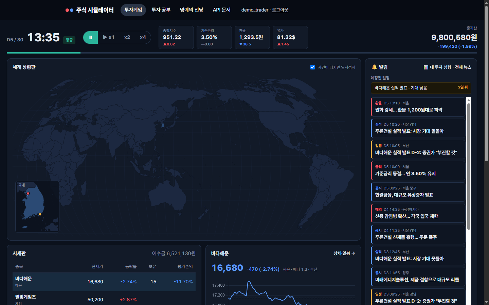
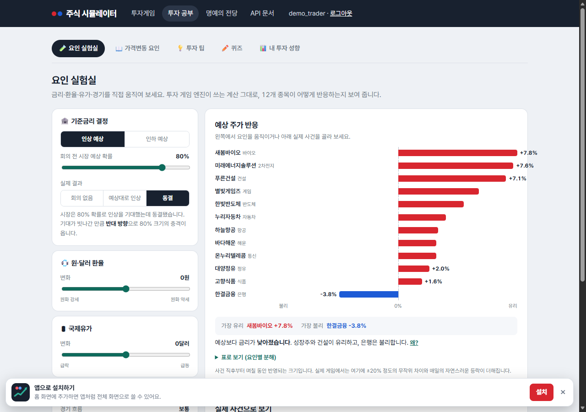
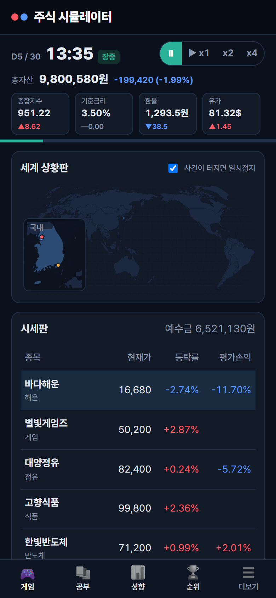

# Event-driven Stock Market Simulator

**가상 경제 이벤트 기반 주식시장 시뮬레이터**

금리 결정·환율·유가·실적 발표·루머 같은 사건이 5분 단위로 공개되고, 업종별 민감도에 따라 12개 가상 종목의 가격이
움직입니다. 가상자금 1,000만 원으로 15거래일(빠른 판) 또는 30거래일(정규 판) 동안 뉴스를 읽고 판단해 투자하고, 끝나면 거래 기록으로 투자 성향을 분석해 줍니다.

| 요인 실험실 | 휴대폰 (PWA) |
|---|---|
|  |  |

## 게임 진행

- 하루 09:00~15:30을 5분 틱으로 진행(×1이면 1.5초에 5분), 15거래일(×1 약 30분) 또는 30거래일(약 1시간). 언제든 일시정지.
- 12개 가상 종목, 업종마다 금리·환율·유가·경기 민감도가 다름.
- 하루 ±30% 가격 제한, 실제 호가 단위, 수수료 0.015%·매도 거래세 0.2%.
- 시장가 주문. 예수금·보유 수량이 모자라거나 장이 닫혀 있으면 사유와 함께 거부된다.
- **사용법 안내**: 게임 화면의 '❓ 사용법' 버튼. 투자 경험을 "처음이에요"로 고른 회원은 처음 들어올 때 자동으로 뜬다.

## 사건과 뉴스

- 금리 결정은 5·12·19·26일째 (15일 판은 5·12일째 두 번).
- 금리 결정·실적 발표는 이틀 전에 예고되고, **예상과 다를수록** 크게 움직인다 (선반영).
- 인수설·실적·임상은 예고되는 순간 결과가 정해지고, 발표 전까지 **[단서] 뉴스**가 나온다
  (인수 후보의 반응, 기관·개인 수급, 내부자 매매, 업종 통계, 추정치 변경, 학회 초록 …). 단서 하나는 틀릴 수 있고
  여러 개가 같은 쪽을 가리키면 결과도 그쪽일 가능성이 높다. 인수설엔 거래소 조회공시 요구와 답변 기한이 뜬다.
  알림 창의 '예정된 일정' 아래와 뉴스 상세의 '사건의 흐름'에 사건별 단서가 모인다.
- 사건의 첫 반응은 뉴스가 뜬 순간 가격에 반영되고, 나머지는 며칠에 걸쳐 반영된다. 뉴스를 보고 사면 이미 오른 가격이다.
- 앞으로 일어날 사건은 미리 알 수 없다. 사건은 공개되는 순간에만 화면에 나온다.

## 투자 공부

- **요인 실험실**: 금리·환율·유가·경기를 움직이면 게임과 같은 식으로 종목 반응을 계산해 보여 준다.
- 가격변동 요인 설명, 투자 팁 12개, 게임 사건으로 만든 퀴즈.
- **오늘의 뉴스**: 실제 경제 뉴스의 제목·요약에서 금리·환율·유가·경기의 방향을 자동 분류하고,
  게임의 업종 민감도표로 유리·불리한 업종을 보여 준다. 게임 시장과는 섞지 않는다.

## 분석과 기록

- **내 투자 성향**: 매매 빈도·위험 선호·집중도·뉴스 민감도 점수와 성향 지도, 손절 습관·뒤늦은 추격 매수·루머 매수·타이밍·비용 분석,
  업종 비중, 가장 잘한·아쉬운 거래, 지난 게임 목록. 코칭은 투자 경험(처음이에요·해 봤어요·자신 있어요)에 맞춘 눈높이로 나오고,
  화면에서 바로 바꿀 수 있다.
- **게임 복기**: 끝난 게임의 내 자산 vs 시장 곡선, 거래한 종목의 일봉 위 매매 시점, 그 종목 뉴스·거래 내역.
- **명예의 전당**: 게임 길이(15·30일)별로 따로 순위. 전체·최근 1주, 투자 경험별로 걸러 보기.

## 회원

- 가입(개인정보 동의 필수)·로그인(5번 틀리면 15분 잠금)·비밀번호 찾기(메일로 한 번만 쓰는 링크).
- 내 정보 수정(닉네임·투자 경험·이메일), 비밀번호 변경(다른 기기 로그인 종료), 탈퇴.
  탈퇴하면 개인정보는 지워지고 게임 기록은 누구 것인지 모르게 남으며 명예의 전당에서 빠진다.
- 관리자는 상단 메뉴의 "회원 관리"에서 회원 목록·상세를 보고 권한 변경·탈퇴 처리를 할 수 있다.

## 휴대폰에 설치 (PWA)

휴대폰 브라우저로 접속하면 '앱으로 설치하기' 안내가 뜹니다 (HTTPS 필요). 연결이 끊기면 오프라인 안내 화면이 나옵니다.
