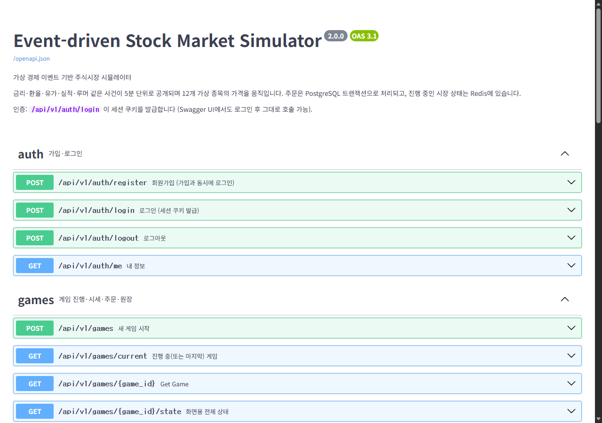
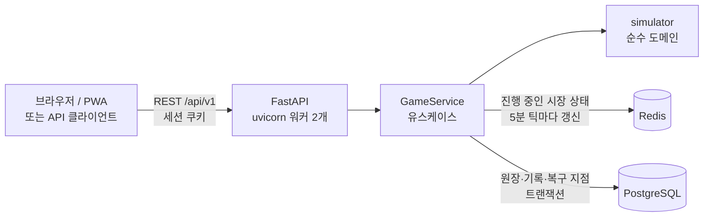

# Event-driven Stock Market Simulator

**가상 경제 이벤트 기반 주식시장 시뮬레이터**

금리 결정·환율·유가·실적 발표·루머 같은 사건이 5분 단위로 공개되고, 업종별 민감도에 따라 12개 가상 종목의 가격이
움직입니다. 가상자금 1,000만 원으로 15거래일(빠른 판) 또는 30거래일(정규 판) 동안 뉴스를 읽고 판단해 투자하고, 끝나면 거래 기록으로 투자 성향을 분석해 줍니다.


| 요인 실험실 | 휴대폰 (PWA) | API 문서 |
|---|---|---|
|  |  |  |

## 빠른 시작

```bash
docker compose up
```

- 게임: <http://localhost:8000>
- API 문서 (Swagger UI): <http://localhost:8000/docs>
- `.env` 없이 로컬 기본값으로 뜹니다. 공개 배포할 때만 `.env.example`을 `.env`로 복사해 `SECRET_KEY` 등을 바꾸세요.

```bash
docker compose --profile test run --rm tests    # 테스트 (실제 PostgreSQL·Redis)
```

## 아키텍처



| 계층 | 위치 | 하는 일 |
|---|---|---|
| 도메인 | `simulator/` | 시장 엔진·사건·가격 결정, 매매 계산(ledger), 투자 성향 분석. **웹·DB를 모르는 순수 파이썬** |
| 서비스 | `server/services/games.py` | 엔진 + Redis + PostgreSQL 조합: 잠금, 저장 순서, 원장 대조, 복구 |
| API | `server/api/` | REST 엔드포인트, Pydantic 검증, OpenAPI 문서 |
| 화면 | `server/web/`, `templates/`, `static/` | Jinja2 화면, 게임 데스크(JS), PWA |
| 저장 | `server/models.py`, `migrations/` | SQLAlchemy 2.0 모델, Alembic 마이그레이션 |

**저장소 역할 분담**

| 데이터 | 저장소 | 이유 |
|---|---|---|
| 예수금·보유·주문·체결 | PostgreSQL (원본) | 트랜잭션·행 잠금·제약조건. 돈은 1원도 틀리면 안 됨 |
| 공개된 뉴스·사건·일봉·일별 자산 | PostgreSQL | 게임이 끝난 뒤에도 조회·복기 |
| 장중 가격·오늘의 사건 계획·남은 효과 | Redis | 5분 틱마다 바뀜. DB 쓰기량을 1/25로 줄임 ([측정](docs/performance.md)) |

테이블 설계(ERD·제약조건·주문 트랜잭션 흐름): [docs/database.md](docs/database.md)

## 기술 스택

Python 3.12 · FastAPI · Pydantic v2 · SQLAlchemy 2.0 · Alembic · PostgreSQL 16 · Redis 7 · pytest ·
Docker Compose · GitHub Actions · Jinja2 · Chart.js · D3(세계지도) · PWA(Service Worker)

## API

모든 게임 API는 로그인이 필요하고, 남의 게임은 404로 존재 자체를 숨깁니다. 전체 명세는 `/docs`.

| 메서드 | 경로 | 설명 |
|---|---|---|
| POST | `/api/v1/auth/register` · `/login` · `/logout` | 가입(개인정보 동의 필수)·로그인(5번 틀리면 15분 잠금)·로그아웃 |
| GET · PATCH · DELETE | `/api/v1/auth/me` | 내 정보 조회·수정(닉네임·투자 경험·이메일)·탈퇴 |
| POST | `/api/v1/auth/password` | 비밀번호 변경 (다른 기기 로그인 종료) |
| POST | `/api/v1/auth/password-reset` · `/password-reset/confirm` | 비밀번호 찾기 메일 · 메일 속 토큰으로 재설정 |
| POST | `/api/v1/games` | 새 게임 `{"days": 15 \| 30}`, 본문이 없으면 15 (진행 중이던 게임은 ABANDONED) |
| GET | `/api/v1/games/current` · `/games/{id}` | 게임 요약 (날짜·시각·총자산) |
| POST | `/api/v1/games/{id}/tick?since=N` | 5분 진행. 그 시각의 사건 공개, 15:30에 장 마감 |
| POST | `/api/v1/games/{id}/next-day` | 다음 거래일 장 시작 |
| GET | `/api/v1/games/{id}/state` | 화면용 전체 상태 (앞으로 일어날 사건은 포함 안 됨) |
| GET | `/api/v1/games/{id}/stocks` · `/stocks/{code}` | 시세, 종목 상세(일봉·장중·업종 민감도) |
| GET | `/api/v1/games/{id}/news?since=N` | 공개된 뉴스 |
| POST | `/api/v1/games/{id}/orders` | 시장가 주문 → 201 체결 / 422 거부(사유 기록) / 200 중복 요청 |
| GET | `/api/v1/games/{id}/orders` · `/trades` · `/portfolio` · `/history` | 주문(거부 포함)·체결·잔고·일별 자산 |
| GET | `/api/v1/games/{id}/analysis` | 투자 성향 분석 |
| GET | `/api/v1/leaderboard?days=30&period=week&experience=beginner` | 명예의 전당 (게임 길이·기간·투자 경험별, 길이 기본 15) |
| GET | `/api/v1/admin/users` · `/admin/users/{id}` | 회원 목록·상세 (permit = ADMIN만, 아니면 403) |
| PATCH · POST | `/api/v1/admin/users/{id}/permit` · `/withdraw` | 권한 변경 (USER ↔ ADMIN) · 탈퇴 처리 |
| GET | `/health` | PostgreSQL·Redis 연결 상태 |

```bash
# 예: 로그인 → 게임 생성 → 5분 진행 → 매수
curl -c jar -X POST localhost:8000/api/v1/auth/register -H 'Content-Type: application/json' \
     -d '{"username":"trader01","password":"secret123"}'
curl -b jar -X POST localhost:8000/api/v1/games
curl -b jar -X POST 'localhost:8000/api/v1/games/1/tick'
curl -b jar -X POST localhost:8000/api/v1/games/1/orders -H 'Content-Type: application/json' \
     -d '{"stock_code":"HBS","side":"BUY","qty":10,"client_order_id":"7f1c-01"}'
```

## 설계에서 신경 쓴 점

**돈**
- **예수금·보유는 PostgreSQL이 원본.** 주문은 `SELECT … FOR UPDATE`로 게임 행을 잠근 한 트랜잭션에서 처리한다.
  워커가 여러 개여도 같은 게임의 주문·틱은 한 줄로 선다. (테스트: 예수금 60%짜리 주문 2개 동시 → 하나만 체결)
- **DB 제약조건이 마지막 방어선.** 예수금 음수 금지, 진행 중 게임 1개(부분 유니크 인덱스), 체결금액 = 가격 × 수량,
  거부된 주문엔 사유 필수, 매도에만 실현손익, 일봉 고가 ≥ 시가·종가 ≥ 저가.
- **거부된 주문도 사유 코드와 함께 기록**한다 (`INSUFFICIENT_CASH`, `MARKET_CLOSED` …). 감사 추적용.
- **중복 제출 방지.** 주문마다 `client_order_id`를 받아 같은 값이 다시 오면 새로 체결하지 않고 처음 결과를 돌려준다.
  화면은 응답을 못 받으면 같은 번호로 한 번 재시도한다.
- **Decimal 계산.** 수수료·세금을 float로 계산하면 `10,000원 × 0.29%`가 `28.999…`가 되어 버림 후 1원이 틀어진다.
  금액은 원 단위 정수, 비율은 Decimal, 평균 매수가는 `NUMERIC(18,4)`.

**Redis와 PostgreSQL 사이의 일관성**
- Redis 저장은 게임 행 잠금을 쥔 채로 **커밋 직전**에 하고, 커밋이 실패하면 Redis 값을 지운다.
- 진행 상태를 읽을 때마다 예수금·보유·체결 목록을 DB 값으로 맞춘다. 프로세스가 Redis 저장과 커밋 사이에 죽어도
  돈은 틀어지지 않는다. (테스트: Redis에 없는 돈을 넣어도 잔고·주문은 DB 기준)
- **Redis가 비어도 복구된다.** 장이 열릴 때마다 엔진 상태를 `game_snapshots`에 저장하고, 비면 그 지점에서
  `games.current_tick`까지 시장을 다시 돌린다. 시장은 (시드, 날, 틱)으로만 결정되고 매매의 영향을 받지 않아
  장중 가격까지 똑같이 재현된다. (테스트: 35틱 진행 중 Redis 삭제 → 같은 시각·가격·보유로 이어서 진행)

**게임의 공정성**
- 오늘 몇 시에 어떤 사건이 터질지는 서버의 Redis에만 있고 **API 응답에도, DB에도 없다.** 사건은 공개되는 순간에만 기록된다.
  예고된 사건의 결과·단서 일정도 마찬가지로, 화면에는 사건 묶음 번호만 나간다.
- 발표 전 단서로 판단할 수 있다. 단서대로 사고파는 봇은 60판 평균 +9%(시장 +1%), 거꾸로 읽는 봇은 −20%.
  단서에 정보는 있지만 판마다 편차가 커서(최악 −43%) 한 번에 다 거는 전략은 여전히 위험하다.
  기존 게임(상태 버전 2)은 예전 규칙 그대로 진행돼 Redis 복구 때도 같은 시장이 재현된다.
- 사건의 첫 반응은 뉴스가 뜬 순간 가격에 반영되고, 나머지는 며칠에 걸쳐 반영된다. 뉴스를 보고 사면 이미 오른 가격이다.
  ("호재 뉴스 즉시 몰빵" 봇이 +54%를 내던 규칙을 고친 결과: 같은 봇이 시장 +3.1%일 때 +5.8%, 최대 낙폭 −12.5%)

**성능** — 자세히: [docs/performance.md](docs/performance.md)

| 구조 | 틱당 DB 쓰기(WAL) | 응답 중앙값 |
|---|---|---|
| v1: 게임 상태 JSONB를 매 틱 UPDATE | 4.9 KB | 6.6 ms |
| v2: Redis + 필요한 것만 INSERT | **0.2 KB** | **8.1 ms** |

v2 첫 버전에서 응답이 54 ms로 느려져 원인을 추적했고, keep-alive 연결에서 요청 본문을 기다리는 동안 생기는
지연 ACK(약 40 ms) 문제로 확인해 틱 요청을 본문 없는 형태로 바꿨다.

## 테스트

```bash
docker compose --profile test run --rm tests
```

102개 (단위 + PostgreSQL·Redis 통합). 통합 테스트는 매번 빈 DB에 **Alembic 마이그레이션부터** 적용하고,
마이그레이션과 모델 정의가 어긋나면 실패한다.

| 파일 | 확인하는 것 |
|---|---|
| `tests/test_ledger.py` | 매수·매도, 예수금·수량 부족, 평균 매수가, 수수료·거래세, 실현손익, Decimal 버림, 최대 매수 수량 |
| `tests/test_engine.py` | 같은 시드 = 같은 시장, 미래 정보 비공개(사건 결과·단서 일정 포함), 단서는 발표 전에만·결과와 일치, 예전 게임은 예전 규칙, ±30% 가격 제한, 호가 단위, 15일·30일 완주(길이에 맞는 금리 결정일), 예수금 원장 일치 |
| `tests/test_analysis.py` | 뉴스 추종 단타형과 분산 장기형이 다르게 판정, 처분 효과(손절 지연) 감지, 경고 단서 무시·단서 활용 판정 |
| `tests/api/test_orders.py` | 체결·거부 기록, 중복 제출, 원장 = 체결 합계, **동시 주문 초과 지출 방지** |
| `tests/api/test_persistence.py` | DB 제약조건 5종, **Redis 유실 복구**, Redis가 DB보다 앞선 경우 교정, 마이그레이션 일치 |
| `tests/api/test_games.py` | 생성·틱·마감·다음 날, 뉴스 DB 저장, 남의 게임 404, 게임 길이 선택, 15일 완주 후 길이별 명예의 전당·복기 화면 |
| `tests/api/test_accounts.py` | 로그인 잠금, 내 정보 수정, 비밀번호 변경 시 다른 세션 종료, 탈퇴, 비밀번호 찾기(한 번만 쓰는 링크) |

테스트가 실제로 버그를 잡는지도 확인했다: 평균 매수가 공식을 틀리게 바꾸거나, 원 미만 버림을 반올림으로 바꾸거나,
게임 행 잠금(`FOR UPDATE`)을 빼면 해당 테스트가 실패한다.

## 게임 규칙

- 하루 09:00~15:30을 5분 틱으로 진행(×1이면 1.5초에 5분), 15거래일(×1 약 30분) 또는 30거래일(약 1시간). 언제든 일시정지.
- 금리 결정은 5·12·19·26일째 (15일 판은 5·12일째 두 번). 명예의 전당은 길이가 같은 게임끼리 따로 순위.
- 가상 회원·게임 기록 넣기: `docker compose exec app python -m scripts.seed_demo` (아이디 `demo_*`, 로그인 불가, `--clear`로 지움)
- 12개 가상 종목, 업종마다 금리·환율·유가·경기 민감도가 다름 (`simulator/catalog.py`).
- 금리 결정·실적 발표는 이틀 전에 예고되고, **예상과 다를수록** 크게 움직인다 (선반영).
- 인수설·실적·임상은 예고되는 순간 결과가 정해지고, 발표 전까지 **[단서] 뉴스**가 나온다
  (인수 후보의 반응, 기관·개인 수급, 내부자 매매, 업종 통계, 추정치 변경, 학회 초록 …). 단서 하나는 틀릴 수 있고
  여러 개가 같은 쪽을 가리키면 결과도 그쪽일 가능성이 높다. 인수설엔 거래소 조회공시 요구와 답변 기한이 뜬다.
  알림 창의 '예정된 일정' 아래와 뉴스 상세의 '사건의 흐름'에 사건별 단서가 모인다.
- 하루 ±30% 가격 제한, 실제 호가 단위, 수수료 0.015%·매도 거래세 0.2%.
- **투자 공부** 탭: 요인 실험실(금리·환율·유가·경기를 움직이면 엔진과 같은 식으로 종목 반응 계산), 가격변동 요인 설명,
  투자 팁 12개, 게임 사건으로 만든 퀴즈.
- **오늘의 뉴스** (`/learn/news`): 실제 경제 뉴스(NAVER API HUB 뉴스 검색)의 제목·요약에서 금리·환율·유가·경기의
  방향을 자동 분류하고, 게임의 업종 민감도표로 유리·불리한 업종을 보여 준다. 게임 시장과는 섞지 않는다.
  30분마다 화면을 열 때 새로 가져오고(하루 호출 상한 `NEWS_DAILY_CAP`), 본문은 저장하지 않으며 30일 지난 뉴스는 지운다.
  키 설정은 `.env.example` 참고, 바로 가져오기: `docker compose exec app python -m scripts.fetch_news`
- **내 투자 성향**: 매매 빈도·위험 선호·집중도·뉴스 민감도 점수, 손절 습관·뒤늦은 추격 매수·루머 매수·타이밍·비용 분석과 코칭.

## 프로젝트 구조

```
simulator/           도메인 (순수 파이썬)
  catalog.py         종목·업종 민감도·사건 목록
  engine.py          시장 진행: 장 시작·5분 틱·마감, 사건, 가격
  ledger.py          매매 계산 (Decimal)
  analysis.py        투자 성향 분석
server/
  main.py            FastAPI 조립 (미들웨어·라우터·예외 처리)
  api/               REST API (auth, games)
  services/games.py  유스케이스: 잠금·저장 순서·원장 대조·복구
  models.py          SQLAlchemy 모델 (13개 테이블)
  runtime.py         Redis 진행 상태 저장소
  web/               HTML 화면
migrations/          Alembic
scripts/             DB 생성, 예전 회원 이관, 틱 프로파일러
tests/               pytest (단위 + 통합)
templates/ static/   화면·게임 데스크·PWA
docs/                DB 설계, 성능 측정, 스크린샷
legacy/              이전 Flask 버전 (참고용)
```

## 휴대폰에 설치 (PWA)

휴대폰 브라우저로 접속하면 '앱으로 설치하기' 안내가 뜹니다 (HTTPS 필요). 내 PC에서 띄운 앱을 외부에 공개하는 방법:

| 방법 | 주소 | 준비 |
|---|---|---|
| `funnel` (고정, 무료) | `https://market-sim.<tailnet>.ts.net` | Tailscale 계정, `.env`에 `TS_AUTHKEY`. 처음 한 번 관리 콘솔에서 HTTPS·Funnel 허용 |
| `cloudflare` (고정) | `https://sim.내도메인.com` | Cloudflare 계정 + 도메인, `.env`에 `CLOUDFLARE_TUNNEL_TOKEN` |
| `tunnel` (임시) | `https://….trycloudflare.com` | 없음. 켤 때마다 주소가 바뀜 (`docker compose logs tunnel`) |

`.env`에 `COMPOSE_PROFILES=funnel`처럼 적어 두면 `docker compose up -d` 때마다 같이 뜨고, 내렸다 올려도 주소가 그대로입니다
(Tailscale 기기 정보는 `tailscale-state` 볼륨에 저장).

## 서버 운영

리눅스 서버(Oracle Cloud 무료)에 올려 계속 운영하는 방법은 [deploy/LINUX.md](deploy/LINUX.md):
서버 만들기, 데이터 옮기기, Tailscale 키 만료 끄기, 매일 백업(`deploy/backup.sh`, 구글 드라이브 복사),
복원(`deploy/restore.sh`), 다운 알림, 업데이트. 컨테이너 로그는 10MB × 3개까지만 남고, 앱 포트(8000)는
서버 안에서만 열린다 (외부 공개는 Tailscale·Cloudflare가 담당).

## 관리자

회원 탈퇴는 행을 지우지 않고 `users.save_status = 'N'`으로 바꾼 뒤 아이디·닉네임·이메일·비밀번호를 지웁니다
(게임 기록은 누구 것인지 모르게 남고 명예의 전당에서 빠짐). 로그인은 `save_status = 'Y'`만 됩니다.
회원 정보는 `users.permit = 'ADMIN'`만 볼 수 있습니다 (상단 메뉴의 "회원 관리").

```bash
docker compose exec app python -m scripts.set_permit 내아이디 ADMIN    # 첫 관리자 지정 (그다음은 화면에서)
```

## 이전 버전에서 옮기기

v1(Flask)의 회원 계정은 비밀번호 해시 형식이 같아 그대로 옮겨집니다: `docker compose exec app python -m scripts.import_legacy_users`
