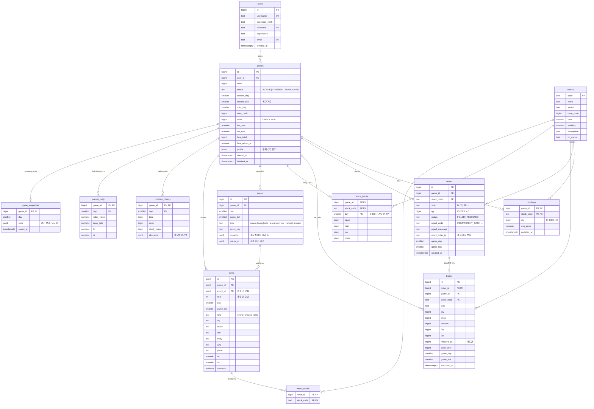

# 데이터베이스 설계

## 원칙

| 구분 | 저장소 | 이유 |
|---|---|---|
| **돈과 원장** (예수금·보유·주문·체결) | PostgreSQL (원본) | 트랜잭션·행 잠금·제약조건으로 1원도 틀리지 않게 |
| **공개된 기록** (뉴스·사건·일봉·일별 자산) | PostgreSQL | 게임이 끝난 뒤에도 조회·분석·복기 |
| **진행 중인 시장 상태** (장중 가격·오늘의 사건 계획·남은 효과) | Redis | 5분 틱마다 바뀜. 매번 DB에 쓰기엔 비쌈 (docs/performance.md) |
| **복구 지점** | PostgreSQL `game_snapshots` + `games.current_tick` | Redis가 비면 그날 장 시작 상태에서 현재 틱까지 다시 돌려 복구 |

- 게임 규칙(업종 민감도·사건 목록)은 **코드**(`simulator/catalog.py`)에 둔다. 규칙은 코드와 함께 버전 관리되고 테스트로 고정된다. 종목 마스터만 FK를 위해 `stocks` 테이블로 동기화한다.
- **아직 일어나지 않은 사건은 DB에 쓰지 않는다.** 사건은 공개되는 순간 `events`/`news`에 기록된다.
- 금액은 원 단위 `BIGINT`, 평균 매수가는 `NUMERIC(18,4)`, 비율은 `NUMERIC(8,6)`. 부동소수점 컬럼에 돈을 넣지 않는다.

모든 테이블과 컬럼에 설명이 DB 주석(`COMMENT ON`)으로 들어 있다 (마이그레이션 `0002`). DB 도구나 psql에서 바로 볼 수 있다:

```bash
docker compose exec db psql -U stocksim -d market_sim -c '\d+ trades'
```

## ERD



## 제약조건과 인덱스

| 대상 | 내용 | 막는 문제 |
|---|---|---|
| `games` | `UNIQUE (user_id) WHERE status = 'ACTIVE'` (부분 유니크 인덱스) | 한 사람이 진행 중인 게임을 둘 갖는 것 |
| `games.cash` | `CHECK (cash >= 0)` | 코드 버그로 예수금이 음수가 되는 것 (DB가 마지막 방어선) |
| `holdings.qty` | `CHECK (qty > 0)`, 0이 되면 행 삭제 | 0주짜리 보유 행 |
| `orders` | `UNIQUE (game_id, client_order_id)` | 네트워크 재시도로 같은 주문이 두 번 체결되는 것 |
| `orders` | `CHECK (status = 'REJECTED') = (reject_code IS NOT NULL)` | 거부 사유 없는 거부, 사유 있는 체결 |
| `trades.order_id` | `UNIQUE` | 주문 하나가 두 번 체결되는 것 (부분 체결을 넣을 땐 해제) |
| `news` | `UNIQUE (game_id, seq)`, 인덱스 `(game_id, seq)` | 새 뉴스만 가져오기 (`?since=`) |
| `trades` | 인덱스 `(game_id, id)` | 거래 내역 조회 |
| `games` | 인덱스 `(status, final_total DESC)` | 명예의 전당 |

## 주문 처리 흐름 (한 트랜잭션)

```
BEGIN
  SELECT … FROM games WHERE id = :game FOR UPDATE      -- 같은 게임의 주문·틱을 한 줄로 세움
  현재 가격 조회 (진행 상태: Redis)
  ledger.buy / ledger.sell  →  체결 결과 또는 OrderRejected
  체결:  UPDATE games.cash · UPSERT/DELETE holdings · INSERT orders(FILLED) · INSERT trades
  거부:  INSERT orders(REJECTED, reject_code)            -- 거부도 기록 (감사 추적)
COMMIT
그 다음 진행 상태(Redis)의 예수금·보유를 갱신
```

진행 상태 갱신이 실패하면 다음 요청 때 **PostgreSQL 값으로 다시 맞춘다** (돈은 DB가 원본).

## 무엇이 언제 기록되나

| 시점 | PostgreSQL에 쓰는 것 |
|---|---|
| 게임 생성 | `games`, 게임 전 30일 차트 → `stock_prices`(day ≤ 0) |
| 5분 틱 | `games.current_tick`, 그 틱에 **공개된** 사건·뉴스만 → `events`, `news`, `news_stocks` |
| 주문 | `orders`, `trades`, `holdings`, `games.cash` |
| 장 마감 | `stock_prices`(그날 OHLC), `portfolio_history`, `market_daily`, `game_snapshots` |
| 게임 종료 | `games.status = FINISHED`, `final_total`, `profile` |

## 복구 절차

1. Redis에 게임 상태가 없으면, 게임 행을 잠근 채로 `game_snapshots`(그날 장 시작 직후 상태)를 읽는다.
2. 예수금·보유·체결 목록을 PostgreSQL 값으로 맞춘다.
3. `games.current_tick`까지 시장을 다시 돌린다. 시장은 (시드, 날, 틱)으로만 정해지고 매매의 영향을 받지 않으므로
   같은 가격·같은 뉴스가 재현된다. 이미 저장된 뉴스 번호까지는 다시 저장하지 않는다.

테스트: `tests/api/test_persistence.py::test_recovers_after_redis_loss`

## 예전 스키마에서 옮기기

- 새 데이터베이스(`market_sim`)를 만들고 Alembic으로 생성한다. 예전 테이블(실시세 모의투자용 `holdings`·`trades`, JSON 한 덩어리인 `games`)과 이름이 겹치기 때문이다.
- 회원 계정(아이디·비밀번호 해시)만 한 번 옮긴다. 진행 중이던 게임은 새 구조로 다시 시작한다.
